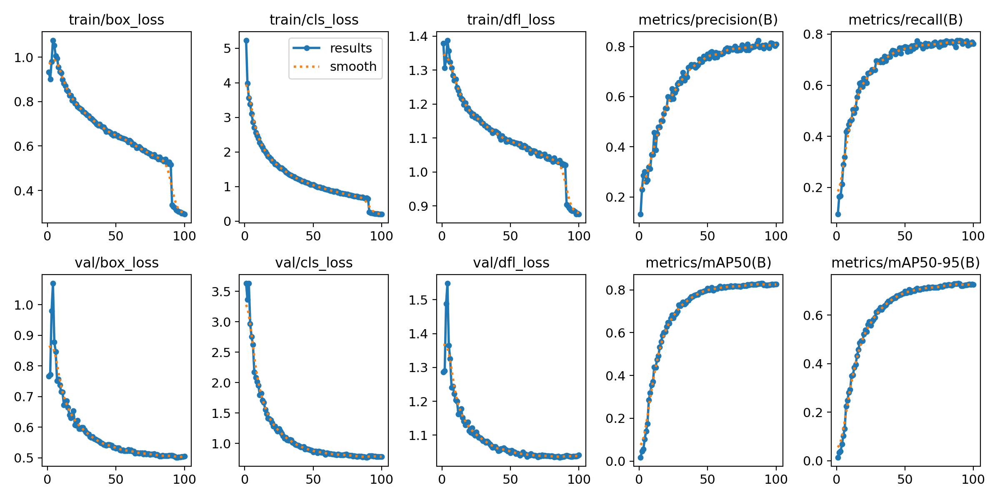

# CUB-200 鸟类检测与辨识系统

这是一个以 YOLOv8s 与 CUB-200-2011 数据集完成的桌面鸟类辨识系统。系统可以载入图片、检测鸟类位置、辨识 200 个鸟种、显示置信度与热力图，并将结果导出为 CSV。

## 成果摘要

保存的 100 epochs 训练纪录显示：

| 指标 | 结果 |
|---|---:|
| Precision | 0.8097 |
| Recall | 0.7631 |
| mAP@50 | **0.8265** |
| mAP@50–95 | **0.7269** |



## 主要功能

- PyQt6 桌面图形界面
- YOLO `.pt` 与 `.onnx` 模型载入
- 单张图片鸟类检测与 200 类鸟种辨识
- CONF 与 IOU 阈值调整
- 检测框、中文鸟名、置信度与热力图显示
- 检测结果 CSV 导出
- CUB-200-2011 标注转换、训练与模型导出流程

## 资料夹结构

```text
.
├── src/                 # 桌面辨识应用
├── training/            # CUB-200 转 YOLO 与训练程式
├── models/              # 保存的最佳训练权重
├── data/classes.txt     # 200 个类别名称（不含图片资料集）
├── results/             # 训练指标、混淆矩阵与输出范例
└── docs/course-reports/ # 期中、期末报告与简报
```

## 执行桌面应用

```powershell
python -m venv .venv
.\.venv\Scripts\Activate.ps1
pip install -r requirements.txt
python src\bird_detection_app.py
```

启动后按「载入模型」，选择：

```text
models/cub200-yolov8s-best.pt
```

再选择一张图片并开始检测。

## 重新训练

本仓库不包含 CUB-200-2011 图片资料集。取得资料集后，可执行：

```powershell
python training\train_cub_yolo.py --mode train --dataset "D:\path\to\CUB_200_2011" --model_size s --epochs 100 --batch_size 16 --img_size 640
```

训练流程会读取原始 CUB 标注，将边界框转换成 YOLO 格式，再训练模型并输出评估结果。

## 训练结果

- [完整训练纪录（CSV）](results/results.csv)
- [混淆矩阵](results/confusion_matrix.png)
- [正规化混淆矩阵](results/confusion_matrix_normalized.png)
- [Precision–Recall 曲线](results/PR_curve.png)
- [检测结果输出范例](results/sample-detection.csv)
- [期末报告](docs/course-reports/final-report.pdf)
- [期中报告](docs/course-reports/midterm-report.pdf)
- [课程简报](docs/course-reports/presentation.pptx)

## 资料与授权说明

CUB-200-2011 原始图片、Python 虚拟环境、训练快取和重复程式版本没有放进这个资料夹。公开仓库前，请先阅读 [公开检查清单](docs/PUBLICATION_CHECKLIST.md)。目前未加入开源许可证；若公开发布，在选择许可证前仍应确认程式、训练权重、课程报告图片与第三方套件的使用条件。

